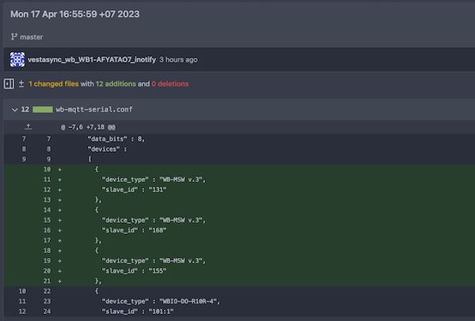
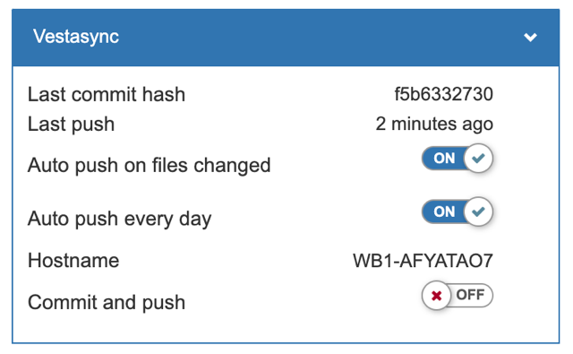

# VestaSync

VestaSync - это ПО для бекапа и восстановления контроллеров Wirenboard. Оно решает две задачи:

1. Создание бекапа конфигурации автоматически и деплой ее на удаленный git-сервер (поддерживается Gitea, для поддержки других сервисов необходимо дописать соответствующую функцию создания репозитория) по расписанию (раз в день) и по изменению файлов.



2. Восстановление бекапа одной командой: после подключения нового контроллера достаточно ввести его IP и имя хоста предыдущего контроллера, чтобы Vestasync автоматически восстановила бекап вплоть до MAC-адресов сетевых интерфейсов, чтобы не было нужды менять настройки на DHCP-сервере. После перезагрузки контроллер вернется в сеть с IP старого контроллера.

VestaSync — это набор скриптов, которые выполняют следующие функции:

1. При первоначальной установке на контроллер:  

    - Создают в /mnt/data/etc/ git-репозитарий  
    - Сохраняют текущие MAC-адреса в /mnt/data/etc/vestasync/macs/eth0(1...)
    - Сохраняют hostname в /mnt/data/etc/vestasync/hostname

2. При изменении конфигурационных файлов

    - Создают коммиты на каждое изменение файлов
    - Загружают эти коммиты на сервер

3. При восстановлении из бекапа

    - Копируют репозитарий
    - Восстанавливают конфиги, hostname и mac-адрес


## Установка VestaSync на локальную машину или запуск докер-контейнера

**Эти команды выполняются не на контроллере**, а на локальной машине или на сервере, с которых есть доступ к контроллеру. Система изначально писалась для инсталляций с множеством контроллеров, поэтому она работает по модели ansible — при запуска на локальной машине сама заходит на пустой контроллер и настраивает его.
Плюс этого подхода в том, что для настройки десяти контроллеров надо просто запустить скрипт локально (подробнее см. Разное-Множественный запуск в этом файле) с разными ```device_ip```, а не заходить на каждый контроллер вручную.

```bash
apt update
apt install python3 python3-pip python3-venv git 
git clone https://github.com/vvzvlad/vestasync
cd vestasync
python3 -m venv .venv
source .venv/bin/activate
pip3 install -r requirements.txt
```

Можно не устанавливать локально, а запустить докер (см. справку по командам ниже):

```bash
docker run --rm -it --name vestasync vvzvlad/vestasync:latest \
./vestasync.py --cmd install \
--device_ip 192.168.1.58 \
--gitea_address http://192.168.1.38:3001/ \
--device_new_name WB_1 \
--gitea_token de8a2eaee0d2f27746157c2fd563815f932d671c
```

## Команды

У Vestasync есть всего две команды: `install` и `restore`.  

### install — установка на контроллер

Команда `install` выполняет подготовительные действия — устанавливает ПО, создает гит-репозитарий, устанавливает службы (подробнее в разделе "Службы").  
Эту команду надо выполнять, указывая в ```device_ip``` исходный контроллер (который будет стоять в проде инсталляции) перед началом эксплуатации (если выполнять ее еще до настройки, то бонусом получим сохранение конфигов и wb-rules в гите во время разработки и ПНР). Эта команда выполняется на контроллере один раз.  


Пример запуска (запускается на локальной машине, адрес контроллера указывается в ```device_ip```):

```bash
./vestasync.py \
--cmd install \
--device_ip 192.168.1.85 \
--gitea_address http://192.168.1.101:3001/ \
--device_new_name WB2 \
--gitea_token de8a2eaee0d2f27746157c2fd563815f932d671c \
--user_cmd user_cmd.sh 
```


```--cmd install``` означает, что надо установить Vestasync на контроллер и подготовить его к созданию бекапа  
```--device_ip``` IP-адрес контроллера  
```--gitea_address``` адрес Gitea-сервера в виде "http://192.168.1.101:3001/", куда будет загружаться бекапы конфигов  
```--device_new_name``` имя контроллера, из которого вместе с SN будет сформировано название контроллера, которое запишется в хостнейм и будет служить именем репозитария с конфигами  
```--gitea_token``` токен для авторизации на Gitea-сервере (получается в интерфейсе Gitea)  
```--user_cmd``` файл sh с командами, которые надо выполняить на контроллере для его настройки под ваши задачи (указывать необязательно). В нем можно описать любые команды, которыми вам надо конфигурировать контроллер: например, установка ключа SSH, установка таймзоны и локали, и так далее.  
Пример файла — ```files/user_cmd.sh```:

```
#!/usr/bin/env sh
timedatectl set-timezone Asia/Krasnoyarsk
localectl set-locale LANG=en_GB.UTF-8
service ntp stop
ntpdate pool.ntp.org
service ntp start
hwclock --systohc --localtime
```


### restore — восстановление из бекапа

Команда `restore` выполняет восстановление существующего бекапа на контроллере.  
Эту команду надо выполнять на подменном контроллере из ЗИП-а в случае замены основного контроллера подменным. Эта команда выполянется один раз, после чего контроллер становится копией старого контроллера и продолжает сохранять свои изменения в конфигах в тот же репозитарий.

Пример запуска (запускается на локальной машине, адрес контроллера указывается в ```device_ip```):

```bash
./vestasync.py \
--cmd restore \
--device_ip 192.168.1.85 \
--gitea_address http://192.168.1.101:3001/ \
--gitea_token de8a2eaee0d2f27746157c2fd563815f932d671c \
--source_hostname WB2-A3TBJXLS \
--reinstall_packages yes
```

Используются те же аргументы, что и в ```install```, но дополнительно еще нужен аругмент ```source_hostname```, который определяет имя контроллера, с которого выполняется бекап. ```device_new_name``` не используется, в качестве имени будет взято имя старого контроллера. Опциональный аргумент ```reinstall_packages``` определяет, надо ли устанавливать пакеты, которые были установлены на старом контроллере.  

**Обратите внимание, что после восстановления бекапа на новом контроллере старый контроллер не должен включаться в сеть, иначе произойдет конфликт адресов.**  

## Службы

Службы, которые будут запущенны на контроллере при установке:

### Восстановление MAC-адресов (apply_macs)

Служба apply_macs отвечает за применение MAC-адресов к сетевым интерфейсам при загрузке системы.  
Эта служба считывает MAC-адреса из файлов, расположенных в каталоге /mnt/data/etc/vestasync/macs/, если они есть, и присваивает их соответствующим интерфейсам, таким как eth0, eth1, wlan0 и т. д. Это используется, если на контроллер был восстанновлен созданный бекап, чтобы сохранять MAC-адреса старого контроллера, и соотвественно, адрес, выданный DHCP. 
Для изменения MAC-адресов на изначальные надо просто удалить все файлы и перезагрузиться:  

```
rm -rf /mnt/data/etc/vestasync/macs/*
reboot
```

Или, если надо сделать это временно, остановить службу: ```systemctl stop apply_macs.service```  
Обратно запустить: ```systemctl start apply_macs.service```  
Узнать статус: ```systemctl status apply_macs.service```  

### Автоматическое версионирование и деплой конфигов (pushgit)

Службы ```pushgit``` (и таймер ```pushgit.timer```) и ```pushgit_inotify``` обеспечивают автоматическое сохранение конфигов в репозиторий Git на удаленном сервере.
Это позволяет сохранять изменения в файлах и версионировать их, что упрощает управление конфигурационными файлами и предотвращает потерю данных при их случайном изменении или удалении.  
Данные сохраняются при каждом сохранении файлов или каждый день, если отключен или не сработал мониторинг сохранения.  
Чтобы отключить сохранение каждый день, надо остановить службу: ```systemctl stop pushgit.timer```. Запустить обратно — ```systemctl start pushgit.timer```.  
Чтобы отключить сохранение по изменению файлов, надо остановить службу: ```systemctl stop pushgit_inotify.service```. Запустить обратно — ```systemctl start pushgit_inotify.service```.  

Для принудительной загрузки конфигов надо выполнить в консоли контроллера ```systemctl start pushgit.service```

Все эти действия можно так же сделать из виджета, скрипт для которого устанавливается на контроллер автоматически.  


## Разное

### Обновление скриптов

При повторном запуске команда ```install``` перезапишет файлы скриптов и сервисов для обновления скриптов на существующих контроллерах, если вышла новая версия VestaSync.
В этом случае в ```--device_ip``` можно передать несколько IP-адресов, разделенных пробелами:  

```bash
./vestasync.py --cmd install \
--device_ip 192.168.98.92 192.168.98.85 \
--gitea_address http://192.168.98.101:3001/ \
--device_new_name WB1 \
--gitea_token de8a2eaee0d2f27746157c2fd563815f932d670c 
```

Обратите внимание, что устанавливать Vestasync на несколько контроллеров лучше с помощью скрипта ниже из раздела "Множественный запуск", потому что при указании набора из нескольких адресов ```device_ip``` с командой ```install``` у них будет одинаковые имена хостов (```--device_new_name WB1```), отличающееся только серийным номером: WB1-AFYATAO7, WB1-A3TBJXLS и так далее.

### Множественный запуск

Если вам надо запустить скрипт сразу на множестве контроллеров, это можно сделать так:

```bash
#!/bin/bash

GITEA_ADDRESS="http://192.168.1.101:3001/"
GITEA_TOKEN="de8a2eaee0d2f27746157c2fd563815f932d671c"
DEVICES=(
    "192.168.1.1 WB1"
    "192.168.1.2 WB2"
    "192.168.1.3 WB3"
    "192.168.1.4 WB4"
    )

for DEVICE_INFO in "${DEVICES[@]}"; do
    IP=$(echo "$DEVICE_INFO" | cut -d ' ' -f1)
    DEVICE_NAME=$(echo "$DEVICE_INFO" | cut -d ' ' -f2)

    echo "Run on $IP/$DEVICE_NAME"
    ./vestasync.py --cmd install --device_ip "$IP" --gitea_address "$GITEA_ADDRESS" --device_new_name "$DEVICE_NAME" --gitea_token "$GITEA_TOKEN"
done
```

### Gitea

В качестве git-сервера используется gitea. Предполагается, что она работает локально, но можно использовать и публичные инсталляции. Устанавливать ее можно любым удобным способом, например с помощью такого docker-compose:

```
version: "3"

networks:
  gitea:
    external: false

services:
  server:
    image: gitea/gitea:1.19.0
    container_name: gitea
    environment:
      - USER_UID=1000
      - USER_GID=1000
      - GITEA__database__DB_TYPE=postgres
      - GITEA__database__HOST=gitea_pg_db:5432
      - GITEA__database__NAME=gitea
      - GITEA__database__USER=gitea
      - GITEA__database__PASSWD=gitea
    restart: always
    networks:
      - gitea
    volumes:
      - /root/gitea/data:/data
      - /etc/timezone:/etc/timezone:ro
      - /etc/localtime:/etc/localtime:ro
    ports:
      - "3001:3000"
      - "222:22"
    depends_on:
      - db

  db:
    image: postgres:14
    restart: always
    container_name: gitea_pg_db
    environment:
      - POSTGRES_USER=gitea
      - POSTGRES_PASSWORD=gitea
      - POSTGRES_DB=gitea
    networks:
      - gitea
    volumes:
      - /root/gitea/pg-data:/var/lib/postgresql/data
```

После запуска контейнера, надо перейти в веб-панель Gitea, создать там пользователя "vestasync", после чего получить в его настройках токен доступа, установив все галочки. В дальнейшем этот токен указывается в ```gitea_token```.
